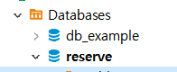
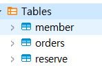
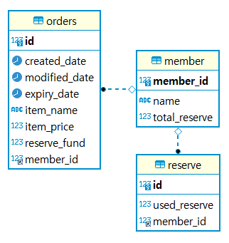

# 회원별 적립 시스템 API 개발

---
## 개발 요구사항

### - 필수 요구사항
> - API에서 회원정보는 '회원번호(회원에게 부여된 유니크한 번호)' 이외의 다른 정보는 전달받지 않음
> - 각 API 에서 ‘회원번호’ 이외에 request, response는 자유롭게 구성
> - 회원 별 적립금 합계는 마이너스가 될 수 없음
> - 개발해야 할 API는 다음과 같습니다.
  >   - 회원별 적립금 합계 조회
> - 회원별 적립금 적립/사용 내역 조회
  >   - 페이징 처리
  >   - 회원별 적립금 적립
> - 회원별 적립금 사용
  >   - 적립금 사용시 우선순위는 먼저 적립된 순서로 사용(FIFO)
> - ORM 사용 (ex: JPA / typeorm 등)

### - 선택 요구사항

> - 적립금의 유효기간 구현 (1년)
> - 회원별 적립금 사용취소 API 개발
  >   - 적립금 사용 API 호출하는 쪽에서 Rollback 처리를 위한 용도
> - 트래픽이 많고, 저장되어 있는 데이터가 많음을 염두에 둔 개발
> - 동시성 이슈가 발생할 수 있는 부분을 염두에 둔 개발

---
## 기술 스택
- Java 17, Spring Boot 2.7.6, Spring Data Jpa 2.7.5, JUnit5, MySQL 8.0.31
- Postman, DBeaver
---

## 실행방법

- MySQL을 설치하고 실행한 후 데이터베이스명 reserve를 생성합니다.  
*DB url : jdbc:mysql://localhost:3306/reserve?allowPublicKeyRetrieval=true&characterEncoding=UTF-8&useUnicode=true&useSSL=false&serverTimezone=Asia/Seoul*  

 

- 프로젝트를 실행하면 JPA에 의해 member, orders, reserve 테이블이 자동 생성됩니다.  

 

- 구현한 아래 API를 Postman으로 테스트하면 됩니다.
  - GET  /api/v1/members/{id}/total-reserve
  - POST /api/v1/members/{id}/reserve
  - GET  /api/v1/members/{id}/reserve/usage-details
  - PUT  /api/v1/members/{id}/reserve
  - GET  /api/v1/members/{id}/reserve/accumulated-details

---
### 과제 설명
#### 1. ERD

#### 2. 구현 사항
> - 회원별 적립금 합계 조회
  >   - 적립금 합계 마이너스 체크
> - 회원별 적립금 적립/사용 내역 조회
  >   - 페이징 처리
  >   - 회원별 적립금 적립
> - 회원별 적립금 사용
  >   - 적립금 사용시 우선순위는 먼저 적립된 순서로 사용(FIFO)
> - 적립금의 유효기간 구현 (1년)
> - API별 트래픽 제한 설정 (bucket4j 이용) 
> - 동시성 이슈 관련 Pessimistic lock 설정
> - JPA, JPQL 사용
> - 잘못된 요청에 대한 Exception class 설정

#### 3. 개선해야할 사항
> - 회원별 적립금 사용취소 API 개발
  >   - 적립금 사용 API 호출하는 쪽에서 Rollback 처리를 위한 용도
> - 트래픽 제한 관련
  >   - 회원별 트래픽 제한
  >   - 테스트 코드 추가
> - 동시성 이슈 관련
  >   - 테스트 코드 추가
> - JWT를 이용한 접근 권한 설정
> - RESTful API(HATEOAS)로 개선
> - 예외 처리 코드 개선
> - Docker compose를 이용한 프로젝트 및 MySQL 운영
